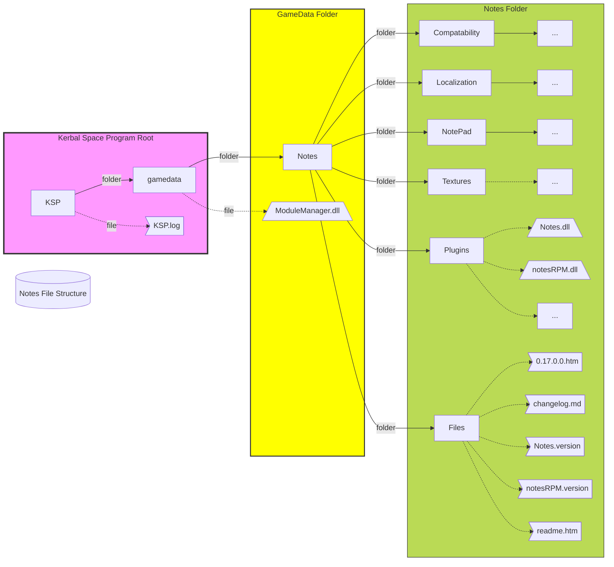

<!-- ManualInstallation.md v1.1.0.0
Notes (NOTE)
created: 01 Oct 2019
updated: 02 Mar 2022 -->

<!-- based upon work by Lisias -->

# Notes (NOTE)

 Simple plugin to take notes in game for Kerbal Space Program.

*formerly ksp_notes*

Notes under zer0Kerbal's management!

## Installation Instructions

### Using CurseForge/OverWolf app or CKAN

You should be all good! (check for latest version on CurseForge)

### If Downloaded from CurseForge/OverWolf manual download

To install, place the GameData folder inside your Kerbal Space Program folder:

* **REMOVE ANY OLD VERSIONS OF THE PRODUCT BEFORE INSTALLING**, including any other fork:
  * )optional( back up `<KSP_ROOT>/GameData/Notes/NotePad` and elsewhere you have saved notes
  * Delete `<KSP_ROOT>/GameData/Notes`
* Extract the package's `Notes/` folder into your KSP's as follows:
  * `<PACKAGE>/Notes` --> `<KSP_ROOT>/GameData/Notes`
    * Overwrite any preexisting file.
    * )optional( restore from backup to `<KSP_ROOT>/GameData/Notes/NotePad`

### If Downloaded from SpaceDock / GitHub / other

To install, place the GameData folder inside your Kerbal Space Program folder:

* **REMOVE ANY OLD VERSIONS OF THE PRODUCT BEFORE INSTALLING**, including any other fork:
  * )optional( back up `<KSP_ROOT>/GameData/Notes/NotePad` and elsewhere you have saved notes
  * Delete `<KSP_ROOT>/GameData/Notes`
* Extract the package's `GameData/` folder into your KSP's as follows:
  * `<PACKAGE>/GameData/Notes` --> `<KSP_ROOT>/GameData`
    * Overwrite any preexisting file.
    * )optional( restore from backup to `<KSP_ROOT>/GameData/Notes/NotePad`

## The following file layout must be present after installation

```
<KSP_ROOT>
  [GameData]
    [Notes]
      [Compatibility]
        ...
      [Localization]
        ...
      [NotePad]
        ...
      [Plugins]
        ...
      [Textures]
        ...
      0.17.0.0.htm
      changelog.md
      GPLv3.txt
      Notes.version
      notesRPM.version
      readme.htm
    ...
  KSP.log
  ...
```



### Dependencies

* none
